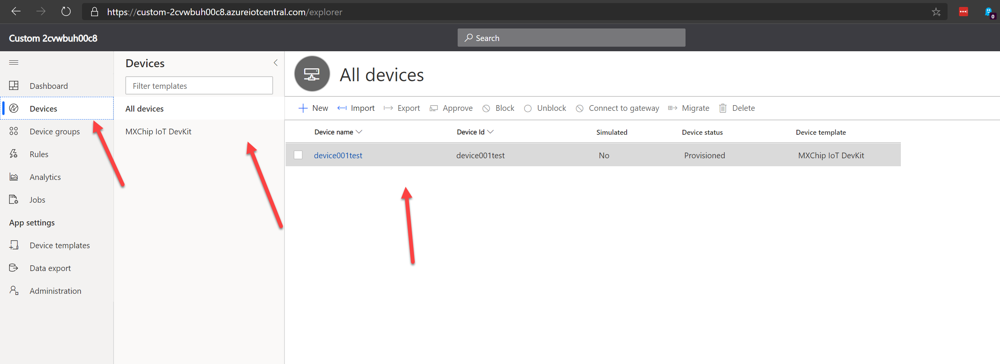

# Connect the MXchip to Azure IoT Central (Preview tempaltes)

In this short workshop (max 1 hour) you will learn howto connect a MXchip (AZ3166) to Azure IoT Central preview templates.

In this quickstart, you create the MXchip device template and add a real device to the system. An MXchip sensor device:

Sends telemetry such as temperature.
Responds to commands such as led on and led off.
Reports generic device properties such as firmware version and serial number

## Create an Azure IoT Central preview environment

If in the workshop no enviornment is given, you have to create first an Azure IoT Central environment to connect the MXchip on. If you have already an environment, please go to the next section.

Navigate to the [Azure IoT Central Build site](https://aka.ms/iotcentral/). Then sign in with a Microsoft personal, work, or school account.

You create a new application either from the list of industry-relevant IoT Central templates to help you get started quickly, or start from scratch using the Custom app template. For this workshop you have to create a custom app and not an industry template.

To create a new Azure IoT Central application:

1. To create a new Azure IoT Central application from an Industry template, select an application template from the list of available templates under one of the industries. You can also start from scratch by choosing Custom app.

2. Azure IoT Central automatically suggests an application name based on the application template you've selected. You can use this name or enter your own friendly application name.

3. Azure IoT Central also generates a unique application URL prefix for you, based on the application name. You use this URL to access your application. You're free to change this URL prefix to something more memorable if you'd like.

4. Review the Terms and Conditions, and select Create at the bottom of the page.

## Device templates

A device template defines the capabilities of a device that connects to your IoT Central application. Capabilities include telemetry the device sends, device properties, and the commands a device responds to. From a device template, a builder or operator can add both real and simulated devices to an application. Simulated devices are useful for testing the behavior of your IoT Central application before you connect real devices.

### Create a template

As a builder, you can create and edit device templates in your application. After you publish a device template, you can generate a simulated device or connect real devices that implement the device template. Simulated devices let you test the behavior of your application before you connect a real device.

To add a new device template to your application, go to the Device Templates page. To do so select the Device Templates tab in the left pane.

Then search for the MXChip IoT DevKit and click on it

Select 'Next Customize' and finish the template

You're Device template is now created!

## Prepare the MXchip

The next step is to prepare the MXchip you have received. Open the box and connect the device via USB to your computer.

### Upload image

Download the custom image for the MXchip [here](./iotc_devkit.bin) and copy the image to the MXchip via the Windows Explorer

### Get configuration of Azure IoT Central

To connect the MXChip to Azure IoT Central you need to have some keys. Login to Azure IoT Central and navigate to 'Administration' and select then 'Device Connection':

Copy the ID Scope and one of the SAS keys and save that in a local notepad. 

### Configure the image

After the copy the device will be restarted with the new image. When the kit restarts, on the screen you should see the following:

    Connect HotSpot:
    AZ3166_??????
    go-> 192.168.0.1
    PIN CODE xxxxx

If the screen displays anything else, reset the device and press the A and B buttons on the device at the same time to reboot the device. This can take around 15 - 20 seconds.

The device is now in access point (AP) mode. You can connect to this WiFi access point from your computer or mobile device.

On your computer, phone, or tablet connect to the WiFi network name shown on the screen of the device. When you connect to this network, you don't have internet access. This state is expected, and you're only connected to this network for a short time while you configure the device.

Open your web browser and navigate to http://192.168.0.1/ The following web page displays:

Connect to the WiFi what is provided during the workshop and fill in the configuration items that you have copied from Azure IoT Central. Just use an own device name. 

After save, the device will be rebooted, connect to Azure IoT Central and register the device.

### See your new device in Azure IoT Central

Login into Azure IoT Central, go to 'Devices', select 'MXchip' and click on your new device

